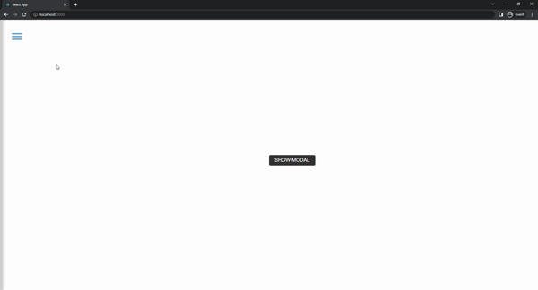

# Sidebar & Modal 
This project consists of a sidebar and modal. The project was created using the "use context" structure. When the sidebar appears on the screen, the menu icon disappears on the home page. Also, when clicking on the "Show Modal" button, the modal opens on the screen.

;

## Used Technologies
* 

* 

* 

## Installation
First clone the project.
```
git clone https://github.com/saglamburcu/react-sidebar.git
```

## Usage
After cloning the project, open it in Visual Studio Code.
```
cd react-sidebar
code .
```
Download node modules to make it work
```
npm install
```
To make it work
```
npm start
```
